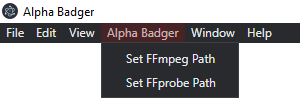

# Alpha-Badger🦡 - DIY FFmpeg Frontend

### **Alpha-Badger🦡** is in alpha stages. Miles to go before I sleep and all that.

---

## What's this? Who is this for?

Some [FFmpeg](https://ffmpeg.org/) capabilities are so niche no UI exist.
With the "do one thing well" philosophy in mind, **Alpha-Badger🦡** is a platform for creating simple user interfaces that abstract complex FFmpeg commands.
The goal is to enable you to build and deliver a focused, single-purpose UI that solves a specific need.

Existing presets:

- Convert video files to gif with optional control on resolution and frame rate
- Compare target video to baseline video - compose baseline, target, and diff into a single output video
- Raw command

Future presets:

- Extract alpha channel to separate video
- Batch create a low-res video clips, composed with timecode and optional watermark

## How can I use it?

1. Have Alpha-Badger🦡 running on your machine by either

   - Download [Alpha-Badger🦡 from "release" page](https://github.com/NoamRa/alpha-badger/releases) and install. There may be OS prompt about unsigned application
   - Checkout the repo and run locally

2. Set FFmpeg and FFprobe. Alpha-Badger🦡 does not come with FFmpeg and FFprobe binaries

   - Download the relevant executables from [FFmpeg.org](https://ffmpeg.org/download.html)
   - Set the path fo FFmpeg and FFprobe in the Alpha Badger menu 

Please note that Alpha-Badger🦡 is not auto updating yet. You can check the version in the help menu.

## Developing

Alpha-Badger🦡 is built using Electron.

- Start with cloning the repo and `npm install`
- Renderer / frontend side updates automatically or after refresh, but for main / backend it might be best to re-run `npm start` again
- Use `npm run checks` to see everything is in order, or individually run `typecheck`, `lint` and `test-all`

### Stack

- Platform: [Electron](https://www.electronjs.org/) and [Electron Forge](https://www.electronforge.io/)
- Main process: [Node.js](https://nodejs.org/) and [TypeScript](https://www.typescriptlang.org/)
- Renderer process:
  - [React](https://reactjs.org/) and [TypeScript](https://www.typescriptlang.org/)
  - [Blueprint](https://blueprintjs.com/) and [Emotion](https://emotion.sh/)
- Bundler: [Webpack](https://webpack.js.org/)
- CI / CD: [Github actions](https://github.com/NoamRa/alpha-badger/tree/main/.github/workflows)
- Code linting and formatting: [ESLint](https://eslint.org/) and [Prettier](https://prettier.io/)
- Testing: [Jest](https://jestjs.io/) and [Testing Library](https://testing-library.com/)

## Release process

- Commit changes. If the change minor or major, use keywords that will be detected by the [bump github action](https://github.com/phips28/gh-action-bump-version#workflow)
- Open a pull request and see that checks pass
- Merge pull request. Version bumping will happen automatically, updating `package.json` and creating a git tag
- Navigate to [new release page](https://github.com/NoamRa/alpha-badger/releases/new), choose the latest tag, fill in the title and add description
- Github action will build and attach the artifacts to the new release, which [can be found here](https://github.com/NoamRa/alpha-badger/releases/latest)

## Questions?

Feel free to [open an issue](https://github.com/NoamRa/alpha-badger/issues/new) on anything and everything. Same for PRs.

## Roadmap

- [x] Finish MVP API - a use should be able to select file, click render and see when render ends
- [x] Block pushing to main branch + run checks before merge to main (CI)
- [x] Set / save / load FFmpeg binary location
- [x] Basic CD - Build app on merge to main
- [x] Modular UI - using presets
- [-] UI component library for easy consumption
- [-] Examples
- [x] Tests
- [ ] Code signing
  - [ ] Windows
  - [ ] macOS
- [ ] Auto updates
- [ ] More presets
- [x] E2E tests
